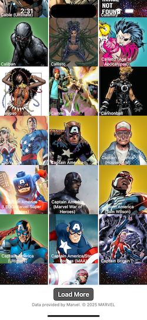
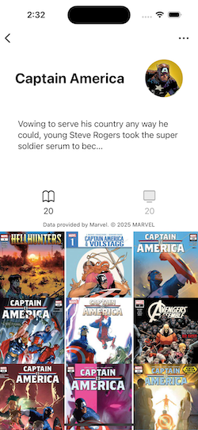
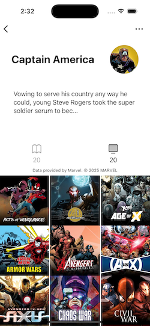

#  MarvelApp

This demo project uses the Marvel Comics API to display characters, comics and events.

## Highlights
* Swift UI
* Async/await API Services
* MVVM Architecture
* Basic Unit Tests

## Screen Shots
| Characters | Comics | Events |
| :-----: | :-----: | :-----: |
|  |  | |
